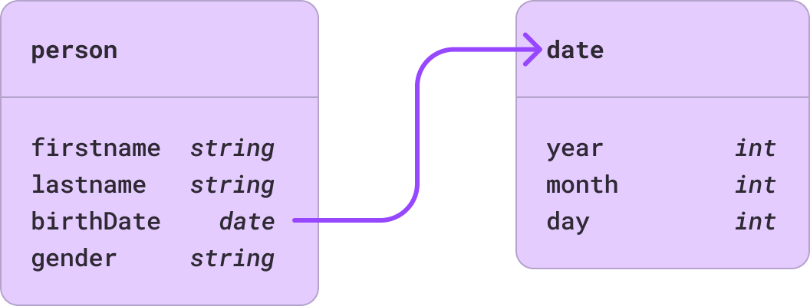

---

## Qui suis-je ?


<CGrid template="1 2" align="center">
<div>


</div>
<div>

*Je me présente, je m’appelle Henri*🎵 Larget


  
Depuis mars 2024 ; chez **Lumapps**, intranet d'entreprise, dans l'équipe **moteur de recherche**

- Décembre 2021 - février 2024 : chez **Lepermislibre,** Auto-école en ligne

- 6 ans chez **Aboutgoods Company**, entreprise spécialisée de collecte et traitement de la donnée de consommation  

- **Formateur** depuis 2016  

Toutes les ressources sont disponibles sur [**learn.henri.run**](http://learn.henri.run)

</div>
</CGrid>

---

## Qu'est-ce qu'on va faire ces prochains jours ensembles

- Jour 1 : Types de données
- Jour 2 : Formats de données
- Jour 3 : listes, arbres, graphs

---

## Evaluation - Aventure textuelle

L'objectif sera de réaliser un petit jeu en CLI : une aventure textuelle.


---

## Mais avant d'attaquer : 


 [henri.run/r/0h5](https://henri.run/r/0h5)

---

# **Qu'est-ce qu'un programme ?**

---

<CGrid template="2 1" align="center">
<div>

Un programme est une suite d'instructions qui spécifie étape par étape, de manière non ambiguë, des représentations de données et des calculs. Les instructions sont destinées à manipuler les données lors de l'exécution du programme.

> [!IMPORTANT]
> 🤔 **Algorithms + Data structures = Programs  — *Niklaus Wirth (1985)***

</div>
<div align="center">


###### **Niklaus Wirth** Professeur d'informatique suisse, inventeur de plusieurs langages de programmation. (1934 - 2024)

</div>
</CGrid>

---

## Algorithmes

**Un algorithme est une suite finie et non-ambiguë d'opérations ou d'instructions permettant de résoudre un problème**

- Provient du nom du mathématicien persan **Al-Khawarizmi** (±820), le père de l'algèbre
- Un problème algorithmique est souvent formulé comme la transformation d'un ensemble de valeurs, d'entrée, en un nouvel ensemble de valeurs, de sortie

**Quelques exemples ?**

--

- Une recette de cuisine ( ingrédients -> plat préparé )

--

- La recherche dans un dictionnaire ( mot -> définition )

---

## **Types de données**


En mathématique, il est fréquent de **classer les variables** selon certaines caractéristiques importantes.

**Les distinctions sont claires** entre les variables réelles, complexes ou logiques, ou entre les variables représentant des valeurs individuelles, ou des ensembles de valeurs, ou des ensembles de ensembles, ou des fonctions, ensembles de fonctions et ainsi de suite.

--

Cette notion de **classification** est tout aussi importante dans **la pratique du traitement des données**. On ne traite pas les données de la même manière.

--

Ces types de données sont intégrés dans **tous** les langages de programmation.


---

## Types primitifs standards

---

### integer

<CGrid template="2 1" align="center">
<div>

Donnée représentant un nombre de l'ensemble des entiers : 0, -10, 42, 9910, -17283… Les entiers ont 5 opérations de base : Addition, Soustraction, Multiplication, Division et Modulo.

- `2 - 17 = -15`
- `2 + 2 = 4`
- `2 * 3 = 6`
- `31/10 = ?`
- `10 % 3 = 1`

</div>
<div>

```go
type hour int
```

</div>
</CGrid>

---


### Float (nombre a virgule flottante)

<CGrid template="1 2" align="center">
<div>

```go
type temperature float
```

</div>
<div>

Donnée représentant un nombre de l'ensemble des réels : -17.3, -5.0, 0.0, 17.0001, 233.4…

</div>
</CGrid>

--

> [!CAUTION]
> <Icon name="warning-circle" /> Le type FLOAT est un type imprécis. 

---

### Boolean

Donnée représentée sous la forme de l'une des deux valeurs : **TRUE** ou **FALSE** 

Cette donnée est le résultat des opérations de comparaison.

```go
type isActive bool
```

---

### **Le type CHAR (Caractère)**

Le caractère est la **représentation graphique** d'une **valeur numérique**.

Il peut être représenté par une série d'impression d'un point, d'une ligne, d'une barre, d'une lettre, d'un chiffre ou d'un symbole. Le caractère est un élément essentiel de la représentation de l'information. La représentation des caractères utilise des codes numériques.

**`'A'`**, **`'z'`**, **`'0'`**, **`'🥑'`**


```go
type c char
```

> [!NOTE]
> Le set de caractères défini par **l'Organisation Internationale de Normalisation (ISO)**, et en particulier sa version américaine ASCII (American Standard Code for Information Interchange), est celui qui est le plus largement accepté. Il consiste en 95 caractères imprimables et en 33 caractères de contrôle, les derniers étant principalement utilisés en transmissions de données et pour le contrôle de l'imprimerie.

---

### **La structure Array (tableau)**

Les tableaux sont probablement le type de structure le plus utilisé en programmation. Un tableau est une liste d'éléments qui sont **tous du même type** appelé : type de base.

Les tableaux sont des structures *d'accès-aléatoire* parce que tous les éléments du tableau peuvent être sélectionnés au hasard et sont aussi **aisément accessibles**.


<CGrid template="2 1" align="center">
<div>

Pour indiquer un élément individuel, le nom de la structure entière est augmenté du numéro d'index sélectionnant le composant, que l'on appelle la clé. Cette clé est un **entier** compris entre n et m, dépendent du langage n pourra être 0 ou 1 et m la longueur du tableau moins n.

</div>
<div>
Exemple de données :

- `[2,-3,4,9,8]`
- `[true,false,false,true]`
- `['H','e','l','l','o','\0']`

```go
type temperatures []float
type item []char
```

```go
type string []char
```

</div>
</CGrid>


---

## **La structure**

Un exemple de traitement de données est de décrire les personnes par quelques caractéristiques pertinentes comme leur nom, prénom et date de naissance et autres.

<CGrid template="1 1">
<div>
La méthode générale la plus courante pour obtenir des types structurés est de joindre des éléments d'une ou plusieurs types, ces éléments étant eux-mêmes des **types structurés**, pour former un composé.

```go
type coordinate4D struct(
    x float
    y float
    z float
    t float
)
// Representation d'un point dans 
// l'espace a un instant t : 4 dimensions
```

</div>
<div>

```go
type complex struct(
    re float
    im float
)
// Representation du nombre complexe -10 + 3i
complex{-10.0, 3.0}
```

Les exemples mathématiques sont les nombres complexes composés de deux nombres réels, les coordonnées d'un point, composées de deux ou plusieurs nombres selon la dimensionnalité de l'espace géométrique.
</div>
</CGrid>

---

Par exemple : on définit une personne par son prénom, son nom, sa date de naissance, et son genre.

```yaml
user:
  firstname: Nadia
  lastname: GOUASMI
  birthDate:
    year: 1993
    month: 5
    day: 21
  gender: unicorn
```

--

```go
type person struct(
    firstname string
    lastname string
    birthDate date
    gender string
)
```

--

```go
type date struct(
    year int
    month int
    day int
)
```

---



---

Qu'est-ce qui motive la définition d'une structure d'une forme ou d'une autre ?

--

- La donnée en **entrée**

--

- La donnée **attendue en sortie**

--

- Le **traitement** même de la donnée